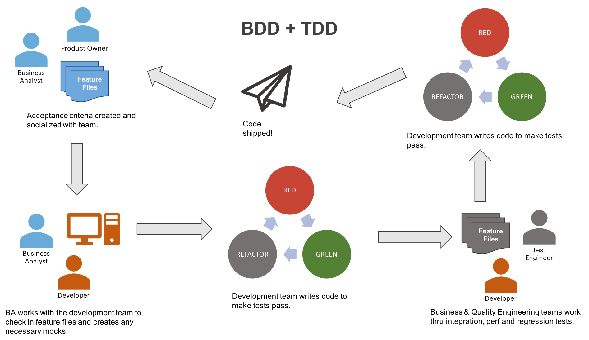

# automated-ui-test

is a Automated UI Test code framework made by Angga Pangestika

## The Equipments
1. Intellij IDE latest version with plugin Lombok,Gherkin,Cucumber.
2. Android SDK built in Latest Android Studio).
3. Android Emulator, set deviceName : device , platformName : Android, platformVersion : 10.0, udid : emulator-5554.
   Pixel : 5.0 1080x1920 420dpi.
4. Chrome Mobile Browser version 90.
5. ChromeDriver version 90.
6. Appium v1.20.2
7. latest build JDK 1.8.xxx
8. Setting Java PATH environment and Android SDK Home (follow the instructions according to the OS you are using) 

## How to Clone

Clone from branch.

```bash
git@gitlab.com:bibit.id/qa/automated-ui-test.git

or 

https://gitlab.com/bibit.id/qa/automated-ui-test.git
```

## Step to create automation test code and file naming.
1. Create Scenario on feature file under src/test/resources/features for ex : CustomOrder.feature
2. Create Class Page for defining element object under src/main/java/demo/pages/bibit for ex: CustomOrderPage.java
3. Create Class Steps for stick it into BDD Scenario steps under src/test/java/demo/steps_definition for ex: CustomOrderSteps.java.

## How to use BasePageObject class method

BasePageObject class is a set of methods that are summarized to be called in another class which will be useful to shorten the writing of code

For example

```java
package demo.pages.bibit;

import demo.pages.base.BasePageObject;

public class MainPage extends BasePageObject {}

```

## How to call method BasePageObject to handle behaviour on new method

Click
```java
public void clickButtonBeli() {
        clickOn(By.xpath("//a[@class='am-button am-button-primary']"));
    }

```
Scroll
```java
public void clickButtonInvestasiSekarang() {
        By locator = By.xpath("//button[contains(text(),'Investasi Sekarang')]");
        scrollIntoView(locator);
        clickOn(locator);
    }
```

GetText
```java
public String termMandiri() {
        return getText(By.xpath("//*[@id=\"root\"]/div/div/div[2]/div/div/div[1]/div[3]/div/div/div[1]/div/div[2]"));
    }
```

FindElement
```java
 public boolean isMandiriLogoVisible(){
        return find(By.xpath("//*[@id=\"root\"]/div/div/div[2]/div/div/div[1]/div[3]/div/div/div[2]/div/div[2]/div[1]/div[1]/div/div[1]/img")).isDisplayed();
    }
```

and many more.

##How to get xpath
1. Install ChroPath (chromeextension)
2. Open webpage
3. F12 (Inspect Element)
4. Activate cursor mode
5. Click on element which you want
6. Click on ChroPath section
7. Copy on RelXpath 

## Contributing
Pull requests are welcome. For major changes, please open an issue first to discuss what you would like to change.

Please make sure to update tests as appropriate.

## How's it Work?

In most environments, contributors - which include Product Owners, Subject Matter Experts, Architects, Solution Owner/Architects, Tech/Team Leads, and more - create [scenarios](docs/SCENARIOS.md) which are added to [feature files](docs/FEATURES.md). In most cases these are added to existing project repositories (or newly created ones).

The developer then reviews the requirements (or acceptance criteria) and creates functionality to support, while running those scnearios as as tests with every change to confirm that there's been no regressions and that the feature is functionally complete.




## License
Under angga pangestika licensing